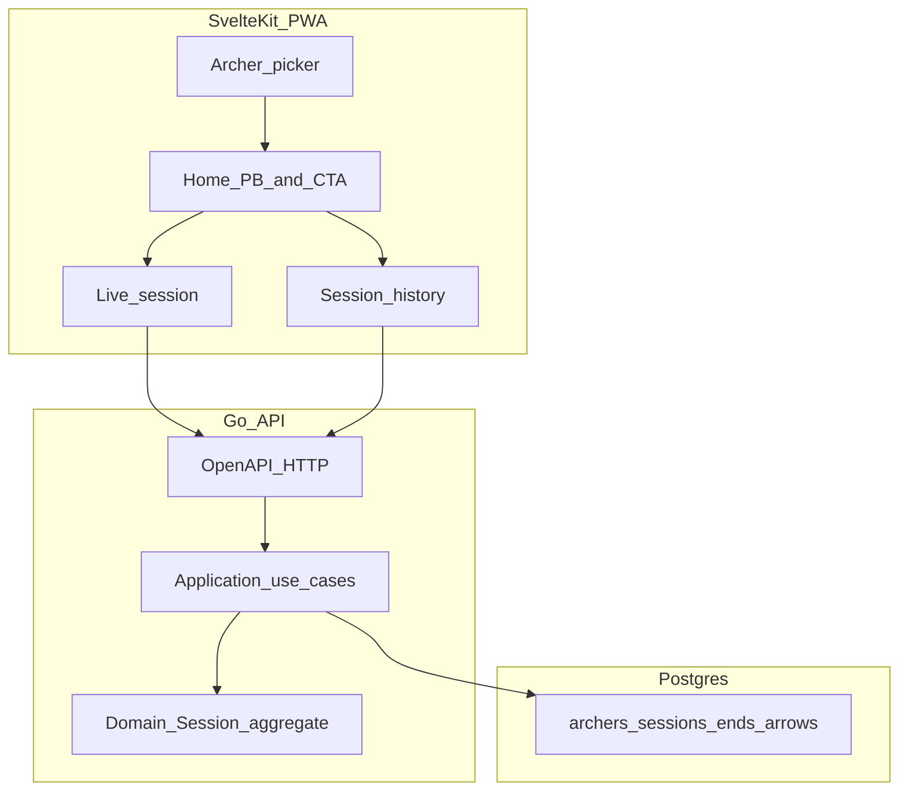
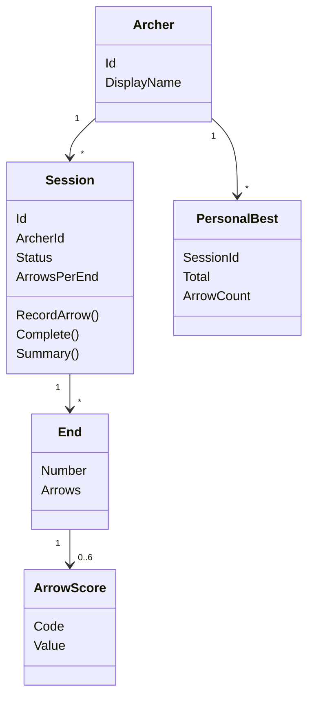

# Architecture

v1 scoring application for two household archers (Tony and Becky). Stack: Postgres, Go API (OpenAPI), SvelteKit PWA. This document is the high-level design and DDD model. Implementation starts with domain tests in [`api/internal/domain`](../api/internal/domain); HTTP and persistence come later.

## Assumptions

- No Keycloak. Two seeded archers; the UI picks an archer; APIs are scoped by `archerId`.
- A **session** is a practice shoot. Arrows are recorded individually but grouped into **ends of 6** (Archery GB habit). Named rounds (Portsmouth) come later.
- Arrow values: `X` (10, inner-10), `10`–`1`, `M` (miss, 0). v1 golds = `9`, `10`, `X`.
- **Total** is a domain calculation on the Session aggregate; also stored as a projection for lists and personal bests.
- **Personal best** = highest **completed** session `total_score` for that archer among sessions with the **same arrow count**. Incomplete sessions do not count. Ties: most recent completed session.
- No edit or delete of arrows in this slice (append-only). No offline sync yet.

## Context

One bounded context: **Scoring**. Who is shooting is an `Archer` entity. A later Keycloak subject can map onto the same id without changing the aggregate.



## Hexagonal layout

```text
SvelteKit  -->  HTTP adapter (OpenAPI)  -->  application use cases  -->  domain
                                              |                         ^
                                              v                         |
                                         Postgres adapter -------- session repo port
```

- `api/internal/domain` must not import `net/http`, `pgx`, or Svelte.
- Application defines ports (`SessionRepository`, `ArcherRepository`).
- Adapters implement ports.

## Domain

### Aggregate root: `Session`

- Identity: `SessionId`
- Holds: `ArcherId`, `StartedAt`, `CompletedAt?`, `Status` (`in_progress` | `completed`), `ArrowsPerEnd` (6), ordered `Ends`
- Invariants:
  - arrows only while `in_progress`
  - an end has at most 6 arrows
  - `Complete` requires at least one arrow
  - totals are derived from arrows
- Behaviour: `RecordArrow(code)`, `Complete()`, `Scorecard()` → total, hits, golds, Xs, arrow count

### Entities

- `Archer` — id, display name (not inside the Session aggregate; referenced by id)
- `Session` — root
- `End` — `EndNumber` (1-based), list of arrows; created automatically when the previous end is full

### Value objects

- `ArrowScore` — `Code` (`X|10|9|…|1|M`) + `NumericValue` (`X` = 10, `M` = 0)
- `ScoreSummary` — total, hits, golds, xCount, arrowCount (never a source of truth)
- `PersonalBest` — archerId, sessionId, total, arrowCount, achievedAt (one per arrow-count bucket)

### Domain service

- `PersonalBestPolicy` — among completed sessions for an archer, same `arrow_count`, max total (tie: most recent)



`PersonalBest` is not persisted as its own table in v1; it is derived from completed `sessions` rows.

## Application use cases

Mapped 1:1 to user stories (plus complete, so personal best is well-defined):

| Story | Use case | HTTP |
| --- | --- | --- |
| Record an archery session | `StartSession` | `POST /api/v1/archers/{archerId}/sessions` |
| Record individual arrow scores | `RecordArrow` | `POST /api/v1/sessions/{sessionId}/arrows` |
| See my total score | `GetSession` | `GET /api/v1/sessions/{sessionId}` |
| See previous sessions | `ListSessions` | `GET /api/v1/archers/{archerId}/sessions` |
| See my personal best | `GetPersonalBest` | `GET /api/v1/archers/{archerId}/personal-best` |
| (supporting) Finish a session | `CompleteSession` | `POST /api/v1/sessions/{sessionId}/complete` |

The application recalculates session projection columns (`total_score`, `arrow_count`, `hit_count`, `gold_count`, `x_count`) in the same transaction as each arrow. Domain tests remain the authority; SQL does not encode scoring rules beyond check constraints.

## Persistence

See [`db/migrations/001_create_schema.sql`](../db/migrations/001_create_schema.sql) and [`db/seed/001_archers.sql`](../db/seed/001_archers.sql).

## HTTP contract

See [`spec/openapi.yaml`](../spec/openapi.yaml). JSON, `/api/v1` prefix. Errors: `{ "code", "message" }`. No `/me` until auth. No PATCH/DELETE in v1.

## TDD order

1. `api/internal/domain` — `RecordArrow`, end rollover at 6, `Total`, `Complete`, reject invalid codes.
2. `api/internal/application` — use cases against in-memory repositories.
3. OpenAPI + generated server stubs; HTTP tests with a fake application layer.
4. Migrations + Postgres adapter tests.
5. `web` — tests for running total and session list mapping; then UI.

## Out of scope (later slices)

Keycloak, UBI Dockerfiles, CircleCI, OKD, offline IndexedDB, named rounds and handicaps.
