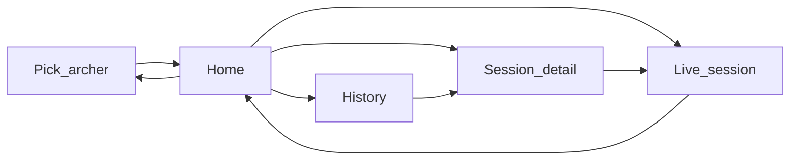

# PWA wireframes

Mobile-first, large hit targets for use at the shooting line. Routes below are the SvelteKit UI spec for v1.

Archer identity is stored in `localStorage` as `archerId` after the picker. There is no login.

## Routes

| Screen | Route | Stories |
| --- | --- | --- |
| W0 Pick archer | `/` | identity for all stories |
| W1 Home | `/home` | personal best, previous sessions, start recording |
| W2 Live session | `/sessions/current` | record arrows, see total |
| W3 History | `/sessions` | previous sessions |
| W4 Session detail | `/sessions/{id}` | total, scorecard |

## W0 — Pick archer (`/`)

Full-width buttons for seeded archers (Tony, Becky). Selecting one writes `archerId` and navigates to `/home`.

```text
┌────────────────────────────────┐
│ Home Archery                   │
│ Who is shooting?               │
│                                │
│ ┌────────────────────────────┐ │
│ │           Tony             │ │
│ └────────────────────────────┘ │
│ ┌────────────────────────────┐ │
│ │           Becky            │ │
│ └────────────────────────────┘ │
└────────────────────────────────┘
```

## W1 — Home (`/home`)

- Header: archer display name and a **Switch** control (returns to W0).
- Personal best card: `PB · 60 arrows · 498`, or “No personal best yet” when there are no completed sessions. If several arrow-count buckets exist, show the most recently achieved PB and a hint that more sit on History.
- Primary action: **Start session** (`POST` session, then W2).
- Last five sessions: date, arrow count, total; star if that row is the PB for its arrow count. Tap opens W4.

```text
┌ W1 Home ───────────────────────┐
│ Becky                  Switch  │
│ ┌ PB 60 arrows  498 ─────────┐ │
│ └────────────────────────────┘ │
│ [ Start session ]              │
│ Yesterday     60    498     ★  │
│ 28 Sep        30    220        │
└────────────────────────────────┘
```

## W2 — Live session (`/sessions/current`)

- Running **total** is the largest number on screen.
- Subline: hits / golds / Xs and current end progress (`End 3 · 4/6`).
- Current end: six slots showing recorded codes.
- 4×3 pad: `X 10 9` / `8 7 6` / `5 4 3` / `2 1 M`.
- **Finish session** completes the session and returns to Home. Disabled until at least one arrow is recorded.

```text
┌ W2 Live ───────────────────────┐
│ End 2 · 3/6                    │
│              147               │
│  H 14   G 6   X 2              │
│ ┌──┐┌──┐┌──┐┌──┐┌──┐┌──┐       │
│ │X ││10││9 ││  ││  ││  │       │
│ └──┘└──┘└──┘└──┘└──┘└──┘       │
│ ┌──┐┌──┐┌──┐                   │
│ │ X││10││ 9│                   │
│ └──┘└──┘└──┘                   │
│ ┌──┐┌──┐┌──┐                   │
│ │ 8││ 7││ 6│                   │
│ └──┘└──┘└──┘                   │
│ ┌──┐┌──┐┌──┐                   │
│ │ 5││ 4││ 3│                   │
│ └──┘└──┘└──┘                   │
│ ┌──┐┌──┐┌──┐                   │
│ │ 2││ 1││ M│                   │
│ └──┘└──┘└──┘                   │
│ [ Finish session ]             │
└────────────────────────────────┘
```

If the app is opened with no in-progress session, redirect to Home.

## W3 — History (`/sessions`)

Chronological cards (newest first): date, arrow count, total; star if this length’s personal best. Tap opens W4. Link or header control back to Home.

```text
┌ W3 History ────────────────────┐
│ Sessions                       │
│ ┌────────────────────────────┐ │
│ │ 5 Oct 2026   60 arr  498 ★ │ │
│ └────────────────────────────┘ │
│ ┌────────────────────────────┐ │
│ │ 28 Sep 2026  30 arr  220   │ │
│ └────────────────────────────┘ │
└────────────────────────────────┘
```

## W4 — Session detail (`/sessions/{id}`)

Read-only scorecard: each end as a row of up to six codes, end total on the right, session summary at the top (total, hits, golds, Xs, arrow count). In-progress sessions can offer a **Resume** action to W2.

```text
┌ W4 Detail ─────────────────────┐
│ 5 Oct 2026                     │
│ Total 498 · 60 arr · H 58 G 22 │
│ End 1   9  7  5  9  8  6   44  │
│ End 2   X 10  9  8  7  6   50  │
│ …                              │
└────────────────────────────────┘
```

## Navigation


